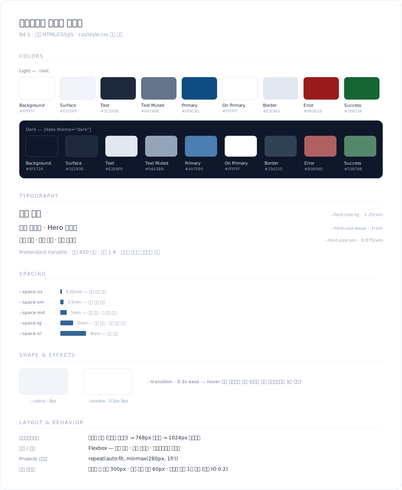

# 디자인 가이드

포트폴리오 웹사이트의 디자인 기준. 모든 값은 `css/style.css`의 CSS 변수로 정의되어 있으며, 이 문서와 코드가 항상 일치해야 한다.

## 1. 디자인 원칙

- **심플**: 장식보다 가독성. 아이콘 라이브러리 없이 유니코드/이모지 아이콘만 사용한다.
- **템플릿 우선**: 콘텐츠(이름, 소개, 링크)는 `[플레이스홀더]`로 비워두고 구조만 잡는다.
- **변수 기반**: 색·폰트·간격은 반드시 CSS 변수를 거친다. 하드코딩 금지.
- **파일 분리**: 브라우저 초기화는 `css/reset.css`, 디자인 결정은 `css/style.css`. 로드 순서는 reset → style.
- **모바일 퍼스트**: 기본 스타일은 모바일 기준, 미디어 쿼리로 확장한다.

## 2. 컬러

### 라이트 테마 (기본, `:root`)

| 토큰 | 값 | 용도 |
|------|-----|------|
| `--color-bg` | `#ffffff` | 페이지 배경 |
| `--color-surface` | `#f1f5f9` | 카드·입력 필드 등 면 배경 |
| `--color-text` | `#1e293b` | 본문 텍스트 |
| `--color-text-muted` | `#64748b` | 보조 텍스트 (부제, 설명) |
| `--color-primary` | `#0f4c81` | 포인트 (버튼, 링크 강조) — 청사진(Prussian blue) 계열 |
| `--color-primary-contrast` | `#ffffff` | 포인트 색 위의 텍스트 |
| `--color-border` | `#e2e8f0` | 경계선 |
| `--color-error` | `#991b1b` | 폼 에러 메시지 — 차분한 어두운 톤 |
| `--color-success` | `#166534` | 폼 성공 메시지 — 차분한 어두운 톤 |

### 다크 테마 (`[data-theme="dark"]`)

| 토큰 | 값 |
|------|-----|
| `--color-bg` | `#0f172a` |
| `--color-surface` | `#1e293b` |
| `--color-text` | `#e2e8f0` |
| `--color-text-muted` | `#94a3b8` |
| `--color-primary` | `#4a7fb0` |
| `--color-border` | `#334155` |
| `--color-error` | `#b06060` |
| `--color-success` | `#55876b` |

에러·성공은 라이트에서 어두운 톤, 다크 배경에서는 가독성을 위해 채도 낮춘 밝은 변형을 쓴다.

## 3. 타이포그래피

- 폰트: Pretendard Variable (jsdelivr CDN, dynamic subset) — 미로드 시 시스템 폰트로 폴백
- **굵기 통일**: 모든 요소 `font-weight: 400` 고정 (`* { font-weight: 400 }`). 크기·색으로만 위계를 표현한다.
- 본문 행간: `1.6`

| 토큰 | 값 | 용도 |
|------|-----|------|
| `--font-size-sm` | `0.875rem` | 보조 정보 (카드 메타, 에러 메시지, 푸터) |
| `--font-size-base` | `1rem` | 본문 (인사말 포함 — Hero도 일반 텍스트 크기) |
| `--font-size-lg` | `1.25rem` | 섹션 제목 (`.section-title`) |
| `--font-size-xl` | `1.5rem` | 대형 강조 (예비) |

## 4. 간격

4px 배수 대신 rem 기반 5단계 스케일을 사용한다.

| 토큰 | 값 | 용도 |
|------|-----|------|
| `--space-xs` | `0.25rem` | 라벨-인풋 사이 등 최소 간격 |
| `--space-sm` | `0.5rem` | 버튼 패딩(세로), 인라인 요소 간격 |
| `--space-md` | `1rem` | 카드 패딩, 폼 필드 간격 |
| `--space-lg` | `2rem` | 섹션 제목 아래, 컴포넌트 블록 간격 |
| `--space-xl` | `4rem` | 섹션 사이 세로 간격 |

## 5. 형태·효과

| 토큰 | 값 | 용도 |
|------|-----|------|
| `--radius` | `8px` | 버튼·카드·인풋 모서리 |
| `--shadow` | `0 2px 8px rgba(0,0,0,0.08)` | 카드 기본 그림자 (다크: 0.4) |
| `--transition` | `0.2s ease` | hover 등 상태 전환 (스크롤 리빌 애니메이션은 1차 범위 제외) |

## 6. 컴포넌트

- **버튼 `.btn`**: 컬러 없이 테두리(`--color-border`)만. 패딩 `sm lg`, radius, transition. hover 시 surface 배경 + 테두리 진해짐. 단일 종 (primary 색은 버튼에 쓰지 않음).
- **카드 `.card`**: surface 배경 + border + shadow + radius, 패딩 `md`. hover 시 그림자 강조. Projects 저장소 카드에 사용.
- **섹션 제목 `.section-title`**: `lg` 크기, 아래 간격 `lg`. 태그는 `<h3>`.
- **폼 `.form`**: 필드 세로 배치, 라벨 위·인풋 아래. 에러는 `--color-error`로 필드 바로 아래, 성공 메시지는 `--color-success`.
- **아이콘**: `[icon: moon]`, `[icon: menu]`, `[icon: arrow-up]` 자리에 유니코드/이모지 문자만 사용. 라이브러리 금지.

## 7. 레이아웃 & 브레이크포인트

- 모바일 퍼스트. 콘텐츠 최대 폭은 컨테이너로 제한 (기준값은 레이아웃 단계에서 확정)
- 태블릿: `@media (min-width: 768px)`
- 데스크톱: `@media (min-width: 1024px)`
- 헤더/네비: Flexbox (로고 왼쪽, 메뉴 오른쪽). 모바일에서는 메뉴 숨김 + 햄버거 노출
- Projects 그리드: `repeat(auto-fit, minmax(280px, 1fr))`

## 8. 동작 기준값 (JS)

| 항목 | 값 |
|------|-----|
| 스크롤 탑 버튼 노출 | 스크롤 300px 이상 |
| 네비 배경 변경 | 스크롤 60px 이상 |
| 스크롤 리빌 애니메이션 | 1차 제외 (추후 IntersectionObserver threshold 0.2) |
